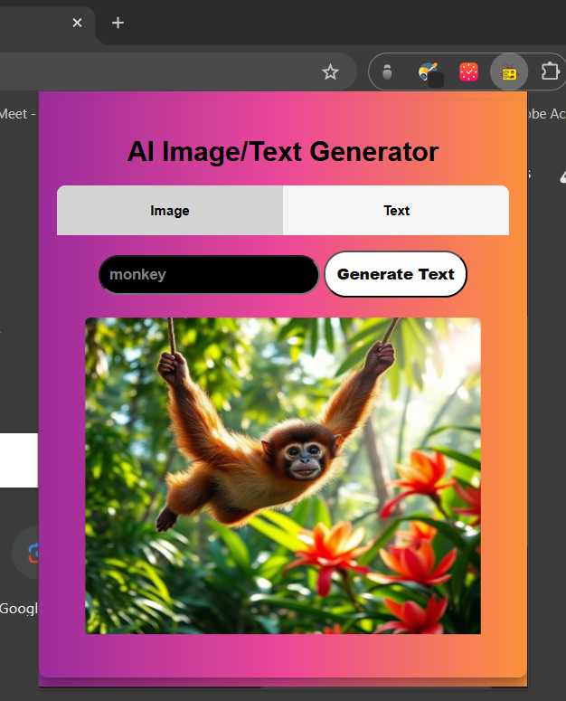
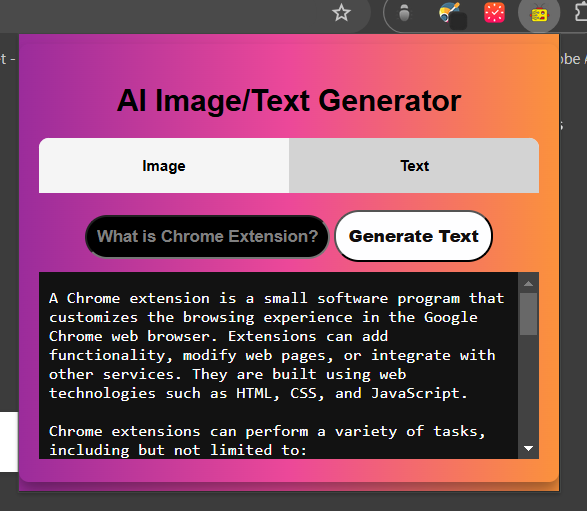

<h1 align="center">AiDrop : Chrome Extension</h1>

## Overview

**AiDrop** is a Chrome extension that allows users to generate and download AI-generated images using the Pollinations API. With AiDrop, you can simply input your desired prompt, generate a unique image, and download it directly to your device, all from the comfort of your browser.

## Features

- **Image Generation**: Generate stunning images based on your text prompts using the Pollinations API.
- **Downloadable Images**: Easily download the generated images to your device.
- **User-Friendly Interface**: Simple and intuitive interface for a seamless user experience.

## Installation

1. Download the latest release of AiDrop from the [releases](https://github.com/yourusername/AiDrop/releases) page.
2. Open Chrome and navigate to `chrome://extensions/`.
3. Enable **Developer mode** (toggle switch in the upper right corner).
4. Click on **Load unpacked** and select the directory where you extracted AiDrop.
5. The AiDrop extension should now be visible in your extensions list.

## Usage

1. Click on the AiDrop icon in your Chrome toolbar to open the extension popup.
2. Enter your desired prompt in the input field.
3. Click the **Generate Image** button.
4. Once the image is generated, you can view it directly in the extension.
5. Click the **Download Image** link to save the generated image to your device.

## API

AiDrop utilizes the [Pollinations API](https://image.pollinations.ai) to generate images based on user prompts. Make sure to check the API documentation for details on available parameters and features.

## Contributing

Contributions are welcome! If you have suggestions for improvements or new features, feel free to submit a pull request or open an issue in the repository.

## License

This project is licensed under the MIT License. See the [LICENSE](LICENSE) file for more details.

## Acknowledgments

- Special thanks to all contributors of [Pollinations API](https://image.pollinations.ai) for providing the image generation capabilities.

## Disclaimer

This project is made for educational purposes. It may not be suitable for commercial use.

